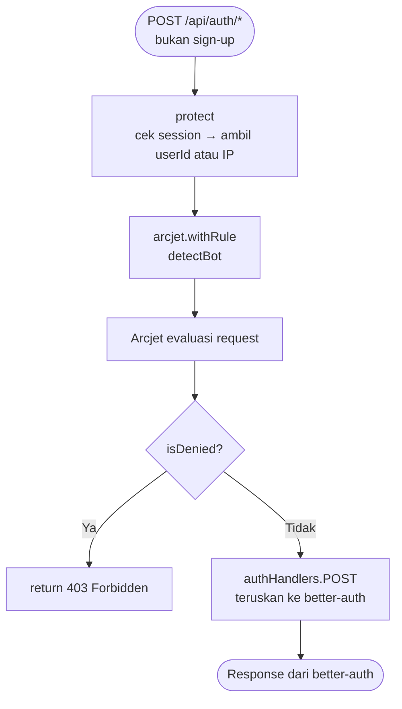
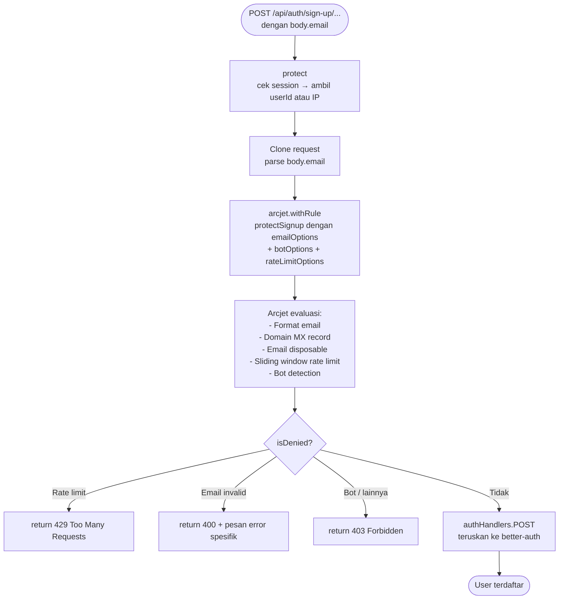
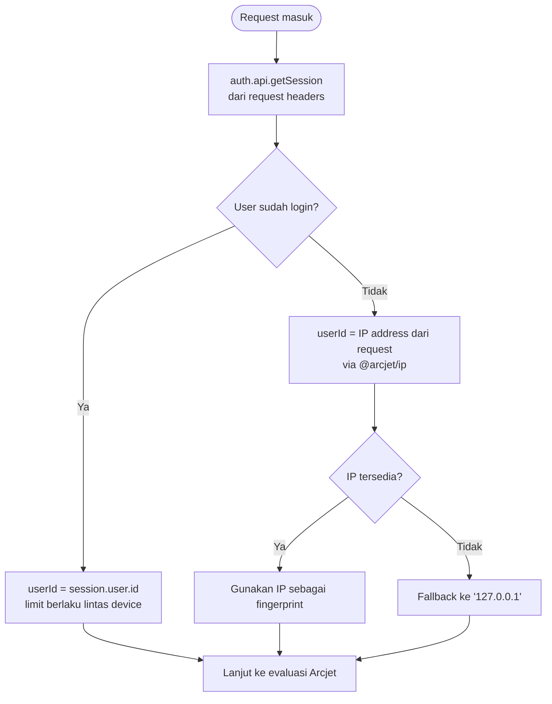

# Dokumentasi Keamanan dengan Arcjet

Dokumen ini menjelaskan implementasi **Arcjet** sebagai lapisan keamanan pada route autentikasi, mencakup proteksi dari bot, validasi email, dan rate limiting — mulai dari dependensi, struktur file, alur kode, hingga penjelasan tiap bagian kode secara detail.

---

## 1. Dependensi

Berikut paket-paket yang ditambahkan untuk integrasi Arcjet:

| Package | Versi | Fungsi |
|---|---|---|
| `@arcjet/next` | ^1.4.0 | Integrasi Arcjet untuk Next.js App Router — menyediakan rules dan client SDK |
| `@arcjet/ip` | ^1.4.0 | Deteksi IP address dari incoming request (termasuk proxy headers) |
| `@arcjet/inspect` | ^1.4.0 | Utilitas untuk menginspeksi Arcjet decision secara programatik |

> **Catatan:** Arcjet berjalan sebagai middleware eksternal — setiap request dievaluasi oleh Arcjet sebelum mencapai handler.

---

## 2. Struktur File

File yang **ditambahkan** atau **diubah** dalam implementasi ini:

```
├── lib/
│   ├── arcjet.ts                # Singleton Arcjet dengan base rule shield (BARU)
│   └── env.ts                   # Tambah validasi ARCJET_KEY
│
└── app/
    └── api/
        └── auth/
            └── [...all]/
                └── route.ts     # POST handler di-wrap dengan Arcjet protect()
```

---

## 3. Alur Kode

### 3.1 Alur POST Request Non-Sign-Up



### 3.2 Alur POST Request Sign-Up dengan Email



### 3.3 Alur Penentuan Fingerprint



---

## 4. Penjelasan dan Kode

### 4.1 `lib/arcjet.ts` — Singleton Arcjet

File baru yang membuat instance Arcjet dengan konfigurasi dasar. Instance ini di-export sebagai default dan digunakan di `route.ts` sebagai titik awal untuk menambahkan rules spesifik via `.withRule()`.

```ts
import arcjet, {
  detectBot,
  fixedWindow,
  protectSignup,
  sensitiveInfo,
  shield,
  slidingWindow,
} from "@arcjet/next";
import { env } from "./env";

// Re-export semua primitif rule agar bisa diimpor dari satu tempat
export {
  detectBot,
  fixedWindow,
  protectSignup,
  sensitiveInfo,
  shield,
  slidingWindow,
};

export default arcjet({
  key: env.ARCJET_KEY,
  characteristics: ["fingerprint"], // identifier unik per request
  rules: [
    shield({ mode: "LIVE" }), // base rule: blok serangan umum (SQLi, XSS, dll)
  ],
});
```

`shield` adalah proteksi dasar Arcjet yang mendeteksi serangan umum seperti SQL injection dan XSS. Rule tambahan dilampirkan per-request via `.withRule()` di `route.ts`.

---

### 4.2 `lib/env.ts` — Tambah Validasi `ARCJET_KEY`

Satu variabel baru ditambahkan ke server-side env validation:

```ts
export const env = createEnv({
  server: {
    DATABASE_URL: z.url(),
    BETTER_AUTH_SECRET: z.string().min(1),
    BETTER_AUTH_URL: z.url(),
    AUTH_GITHUB_CLIENT_ID: z.string().min(1),
    AUTH_GITHUB_SECRET: z.string().min(1),
    RESEND_API_KEY: z.string().min(1),
    ARCJET_KEY: z.string().min(1), // Tambahan baru
  },
  experimental__runtimeEnv: {},
});
```

**Environment variable yang perlu ditambahkan ke `.env`:**

```env
ARCJET_KEY=ajkey_...   # API key dari dashboard arcjet.com
```

---

### 4.3 `app/api/auth/[...all]/route.ts` — Integrasi Arcjet

File ini sebelumnya hanya 3 baris. Sekarang di-rewrite lengkap dengan lapisan proteksi Arcjet yang membungkus POST handler better-auth.

#### Konfigurasi Rules

Rules dikonfigurasi di level modul (bukan di dalam handler) agar tidak dibuat ulang setiap request:

```ts
const emailOptions = {
  mode: "LIVE",
  deny: ["DISPOSABLE", "INVALID", "NO_MX_RECORDS"],
} satisfies EmailOptions;

const botOptions = {
  mode: "LIVE",
  allow: [], // blok semua bot
} satisfies BotOptions;

const rateLimitOptions = {
  mode: "LIVE",
  interval: "2m",  // sliding window 2 menit
  max: 5,           // maksimal 5 request dalam window
} satisfies SlidingWindowRateLimitOptions<[]>;

const signupOptions = {
  email: emailOptions,
  bots: botOptions,
  rateLimit: rateLimitOptions,
} satisfies ProtectSignupOptions<[]>;
```

> **Catatan:** `mode: "LIVE"` berarti request benar-benar diblokir. Ganti ke `"DRY_RUN"` untuk logging saja tanpa memblokir — berguna saat testing.

#### Fungsi `protect()`

Fungsi ini mengambil keputusan Arcjet berdasarkan konteks request:

```ts
async function protect(req: NextRequest): Promise<ArcjetDecision> {
  const session = await auth.api.getSession({ headers: req.headers });

  // User login → gunakan userId. Guest → gunakan IP address
  let userId: string;
  if (session?.user.id) {
    userId = session.user.id;
  } else {
    userId = ip(req) || "127.0.0.1";
  }

  // Jalur sign-up mendapat proteksi lebih ketat
  if (req.nextUrl.pathname.startsWith("/api/auth/sign-up")) {
    const body = await req.clone().json(); // clone karena body hanya bisa dibaca sekali

    if (typeof body.email === "string") {
      // Jalankan protectSignup lengkap (email + bot + rate limit)
      return arcjet
        .withRule(protectSignup(signupOptions))
        .protect(req, { email: body.email, fingerprint: userId });
    } else {
      // Tanpa email → hanya bot detection + rate limit
      return arcjet
        .withRule(detectBot(botOptions))
        .withRule(slidingWindow(rateLimitOptions))
        .protect(req, { fingerprint: userId });
    }
  } else {
    // Semua route auth lain → hanya bot detection
    return arcjet
      .withRule(detectBot(botOptions))
      .protect(req, { fingerprint: userId });
  }
}
```

Request di-`clone()` sebelum membaca body karena better-auth juga akan membaca body yang sama — stream body hanya bisa dikonsumsi sekali.

#### POST Handler

```ts
const authHandlers = toNextJsHandler(auth.handler);

export const { GET } = authHandlers; // GET tidak butuh proteksi Arcjet

export const POST = async (req: NextRequest) => {
  const decision = await protect(req);

  if (decision.isDenied()) {
    if (decision.reason.isRateLimit()) {
      return new Response(null, { status: 429 });
    } else if (decision.reason.isEmail()) {
      let message: string;

      if (decision.reason.emailTypes.includes("INVALID")) {
        message = "Email address format is invalid. Is there a typo?";
      } else if (decision.reason.emailTypes.includes("DISPOSABLE")) {
        message = "We do not allow disposable email addresses.";
      } else if (decision.reason.emailTypes.includes("NO_MX_RECORDS")) {
        message = "Your email domain does not have an MX record. Is there a typo?";
      } else {
        message = "Invalid email.";
      }

      return Response.json({ message }, { status: 400 });
    } else {
      return new Response(null, { status: 403 });
    }
  }

  return authHandlers.POST(req); // Lolos Arcjet → teruskan ke better-auth
};
```

GET tidak di-wrap karena operasi read-only (cek session, OAuth callback) tidak perlu rate limiting.

---

## Ringkasan Pola Penting

| Skenario | Rule yang Aktif | HTTP Status |
|---|---|---|
| Bot terdeteksi (semua route) | `detectBot` | 403 |
| Rate limit terlampaui (sign-up) | `slidingWindow` (via `protectSignup`) | 429 |
| Email format tidak valid | `protectSignup` → emailTypes `INVALID` | 400 |
| Email disposable | `protectSignup` → emailTypes `DISPOSABLE` | 400 |
| Domain email tanpa MX record | `protectSignup` → emailTypes `NO_MX_RECORDS` | 400 |
| Serangan umum (SQLi, XSS) | `shield` (base rule, semua request) | 403 |
| Request normal | — | diteruskan ke `authHandlers.POST` |
