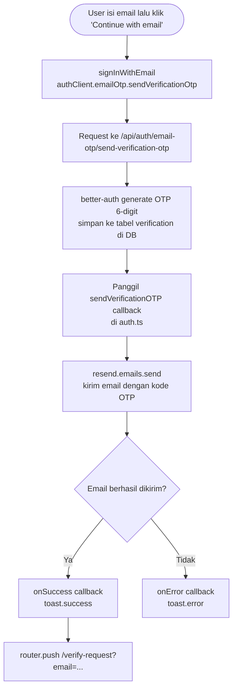
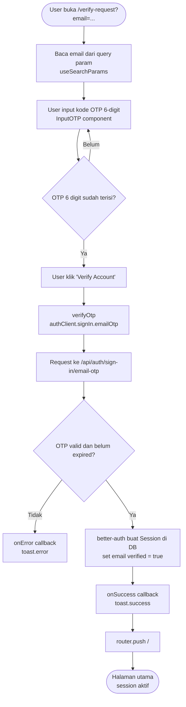

# Dokumentasi Autentikasi Email OTP

Dokumen ini menjelaskan implementasi autentikasi via **Email OTP (One-Time Password)** yang ditambahkan di atas sistem OAuth GitHub yang sudah ada, mencakup dependensi baru, struktur file, alur kode, hingga penjelasan tiap bagian kode secara detail.

---

## 1. Dependensi

Berikut paket-paket yang ditambahkan untuk mendukung autentikasi email OTP:

| Package | Versi | Fungsi |
|---|---|---|
| `resend` | ^6.12.4 | Layanan pengiriman email transaksional — digunakan untuk kirim kode OTP ke user |
| `input-otp` | ^1.4.2 | Komponen UI input OTP 6-digit dengan slot terpisah (digunakan via shadcn/ui) |

> **Catatan:** Plugin `emailOTP` sudah termasuk dalam paket `better-auth` — tidak perlu instalasi terpisah.

---

## 2. Struktur File

File yang **ditambahkan** atau **diubah** dalam implementasi ini:

```
├── lib/
│   ├── auth.ts              # Tambah plugin emailOTP + fungsi sendVerificationOTP
│   ├── auth-client.ts       # Tambah plugin emailOTPClient
│   ├── env.ts               # Tambah validasi RESEND_API_KEY
│   └── resend.ts            # Singleton Resend client (BARU)
│
└── app/
    └── (auth)/
        ├── login/
        │   └── _components/
        │       └── LoginForm.tsx    # Input email fungsional + fungsi signInWithEmail
        │
        └── verify-request/
            └── page.tsx             # Halaman verifikasi OTP 6-digit (BARU)
```

---

## 3. Alur Kode

### 3.1 Alur Kirim OTP via Email



### 3.2 Alur Verifikasi OTP



---

## 4. Penjelasan dan Kode

### 4.1 `lib/resend.ts` — Singleton Resend Client

File baru yang membungkus Resend SDK menjadi singleton. Pola ini konsisten dengan `lib/db.ts` — instance dibuat sekali dan di-export untuk digunakan di seluruh aplikasi.

```ts
import { Resend } from "resend";
import { env } from "./env";

export const resend = new Resend(env.RESEND_API_KEY);
```

`RESEND_API_KEY` diambil melalui `env` (bukan langsung dari `process.env`) agar tetap tervalidasi saat startup.

---

### 4.2 `lib/env.ts` — Tambah Validasi `RESEND_API_KEY`

Satu variabel baru ditambahkan ke server-side env validation:

```ts
import { createEnv } from "@t3-oss/env-nextjs";
import * as z from "zod";

export const env = createEnv({
  server: {
    DATABASE_URL: z.url(),
    BETTER_AUTH_SECRET: z.string().min(1),
    BETTER_AUTH_URL: z.url(),
    AUTH_GITHUB_CLIENT_ID: z.string().min(1),
    AUTH_GITHUB_SECRET: z.string().min(1),
    RESEND_API_KEY: z.string().min(1), // Tambahan baru
  },
  experimental__runtimeEnv: {},
});
```

**Environment variable yang perlu ditambahkan ke `.env`:**

```env
RESEND_API_KEY=re_...   # API key dari dashboard resend.com
```

---

### 4.3 `lib/auth.ts` — Plugin `emailOTP`

Plugin `emailOTP` ditambahkan ke array `plugins`. Plugin ini menyediakan endpoint `/api/auth/email-otp/*` dan mengelola pembuatan serta validasi OTP di tabel `verification`.

```ts
import { betterAuth } from "better-auth";
import { prismaAdapter } from "better-auth/adapters/prisma";
import { emailOTP } from "better-auth/plugins";
import { prisma } from "./db";
import { env } from "./env";
import { resend } from "./resend";

export const auth = betterAuth({
  database: prismaAdapter(prisma, {
    provider: "postgresql",
  }),
  socialProviders: {
    github: {
      clientId: env.AUTH_GITHUB_CLIENT_ID,
      clientSecret: env.AUTH_GITHUB_SECRET,
    },
  },
  plugins: [
    emailOTP({
      async sendVerificationOTP({ email, otp }) {
        await resend.emails.send({
          from: "LearnLMS <onboarding@resend.dev>",
          to: [email],
          subject: "LearnLMS - Verify your email",
          html: `<p>Your OTP is <strong>${otp}</strong></p>`,
        });
      },
    }),
  ],
});
```

`sendVerificationOTP` adalah callback yang dipanggil oleh better-auth setiap kali OTP perlu dikirim. OTP di-generate dan disimpan ke DB oleh better-auth — kita hanya bertanggung jawab untuk pengirimannya.

---

### 4.4 `lib/auth-client.ts` — Plugin `emailOTPClient`

Versi client-side dari plugin OTP. Menambahkan method `authClient.emailOtp.*` dan `authClient.signIn.emailOtp` yang bisa digunakan di Client Components.

```ts
import { createAuthClient } from "better-auth/react";
import { emailOTPClient } from "better-auth/client/plugins";

export const authClient = createAuthClient({
  plugins: [
    emailOTPClient(),
  ],
});
```

---

### 4.5 `app/(auth)/login/_components/LoginForm.tsx` — Email Input Fungsional

Sebelumnya input email hanya placeholder UI. Sekarang fungsional dengan state `email`, `useTransition` untuk loading state, dan fungsi `signInWithEmail` yang memanggil API OTP.

```tsx
"use client";

import { authClient } from "@/lib/auth-client";
import { useState, useTransition } from "react";
import { toast } from "sonner";
import { useRouter } from "next/navigation";

export default function LoginForm() {
  const router = useRouter();
  const [emailPending, startEmailTransition] = useTransition();
  const [email, setEmail] = useState("");

  function signInWithEmail() {
    startEmailTransition(async () => {
      await authClient.emailOtp.sendVerificationOtp({
        email: email,
        type: "sign-in",
        fetchOptions: {
          onSuccess: () => {
            toast.success("Email Sent");
            router.push(`/verify-request?email=${email}`);
          },
          onError: () => {
            toast.error("Error Sending Email");
          },
        },
      });
    });
  }

  // ... JSX dengan Input email dan Button
}
```

`type: "sign-in"` memberitahu better-auth tujuan OTP ini — bisa juga `"email-verification"` atau `"forget-password"`.

---

### 4.6 `app/(auth)/verify-request/page.tsx` — Halaman Verifikasi OTP

Halaman baru yang menerima email dari query param dan menampilkan input OTP 6-digit. Tombol "Verify Account" hanya aktif setelah semua 6 slot terisi.

```tsx
"use client";

import { InputOTP, InputOTPGroup, InputOTPSeparator, InputOTPSlot } from "@/components/ui/input-otp";
import { authClient } from "@/lib/auth-client";
import { useRouter, useSearchParams } from "next/navigation";
import { useState, useTransition } from "react";
import { toast } from "sonner";

export default function VerifyRequest() {
  const router = useRouter();
  const [otp, setOtp] = useState("");
  const [emailPending, startTransition] = useTransition();
  const params = useSearchParams();
  const email = params.get("email");
  const isOtpCompleted = otp.length === 6;

  function verifyOtp() {
    startTransition(async () => {
      await authClient.signIn.emailOtp({
        email: email,
        otp: otp,
        fetchOptions: {
          onSuccess: () => {
            toast.success("Email verified");
            router.push("/");
          },
          onError: () => {
            toast.error("Error verifying Email/OTP");
          },
        },
      });
    });
  }

  return (
    // Card dengan InputOTP dan tombol Verify Account
    <InputOTP maxLength={6} value={otp} onChange={(value) => setOtp(value)}>
      <InputOTPGroup>
        <InputOTPSlot index={0} />
        <InputOTPSlot index={1} />
        <InputOTPSlot index={2} />
      </InputOTPGroup>
      <InputOTPSeparator />
      <InputOTPGroup>
        <InputOTPSlot index={3} />
        <InputOTPSlot index={4} />
        <InputOTPSlot index={5} />
      </InputOTPGroup>
    </InputOTP>
  );
}
```

> **Catatan:** `email` diambil dari URL query param (`?email=...`) yang di-set saat redirect dari halaman login. Halaman ini tidak memvalidasi bahwa email-nya valid di server — validasi terjadi saat `signIn.emailOtp` dipanggil.

---

## Ringkasan Pola Penting

| Aksi | Method | Import dari |
|---|---|---|
| Kirim OTP ke email | `authClient.emailOtp.sendVerificationOtp({ email, type })` | `@/lib/auth-client` |
| Verifikasi OTP & sign in | `authClient.signIn.emailOtp({ email, otp })` | `@/lib/auth-client` |
| Kirim email (server) | `resend.emails.send(...)` | `@/lib/resend` |
