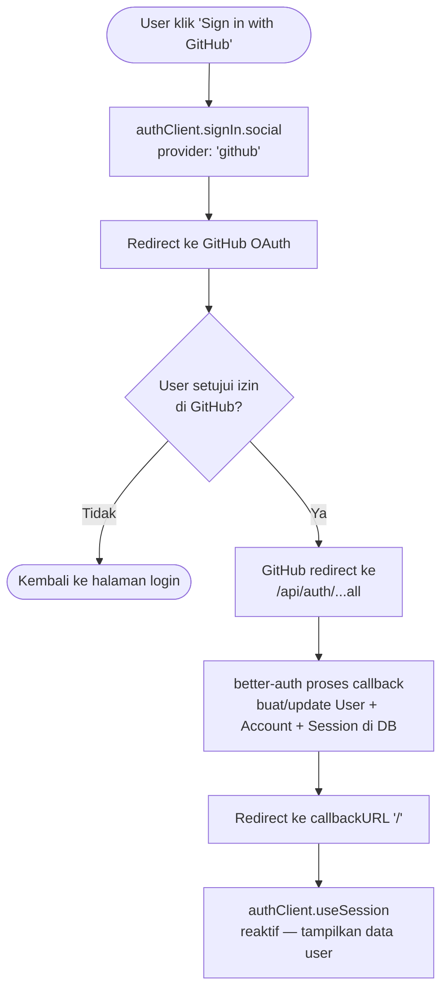
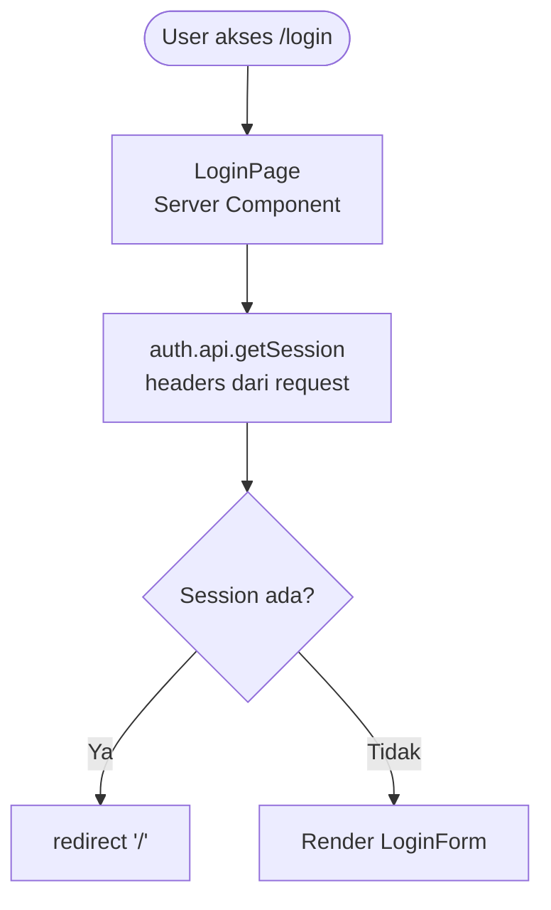
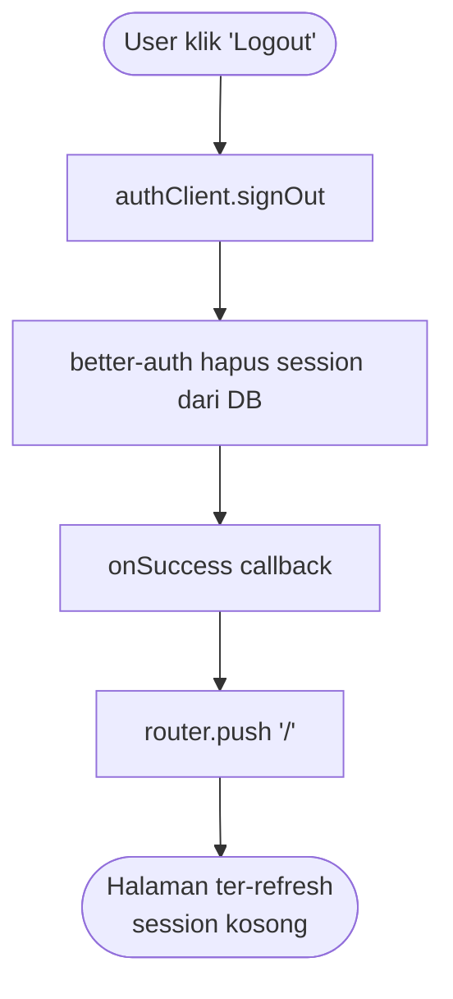

Dokumen ini menjelaskan sistem autentikasi yang digunakan pada proyek ini, mulai dari dependensi, struktur file, alur kode, hingga penjelasan tiap bagian kode secara detail.

---

## 1. Dependensi

Berikut paket-paket yang terlibat langsung dalam sistem autentikasi:

| Package | Versi | Fungsi |
|---|---|---|
| `better-auth` | 1.6.11 | Library autentikasi utama — mengelola OAuth, session, dan database |
| `@prisma/client` | ^7.8.0 | ORM untuk membaca dan menulis data ke database |
| `@prisma/adapter-pg` | ^7.8.0 | Adapter driver PostgreSQL native untuk Prisma 7 |
| `@t3-oss/env-nextjs` | ^0.13.11 | Validasi environment variables saat build/runtime |
| `zod` | ^4.4.3 | Schema validation — digunakan oleh `env.ts` |

---

## 2. Struktur File

```
├── lib/
│   ├── auth.ts              # Instance better-auth (server-side)
│   ├── auth-client.ts       # Instance better-auth (client-side / browser)
│   ├── db.ts                # Prisma singleton dengan PrismaPg adapter
│   └── env.ts               # Environment variables tervalidasi
│
├── prisma/
│   └── schema.prisma        # Definisi model: User, Session, Account, Verification
│
├── app/
│   ├── (auth)/
│   │   ├── layout.tsx       # Layout terpusat untuk halaman-halaman auth
│   │   └── login/
│   │       ├── page.tsx     # Server Component — proteksi halaman login
│   │       └── _components/
│   │           └── LoginForm.tsx  # Client Component — UI dan logika sign in
│   │
│   ├── api/
│   │   └── auth/
│   │       └── [...all]/
│   │           └── route.ts # Catch-all API route untuk better-auth
│   │
│   └── page.tsx             # Halaman utama — menampilkan state session
```

---

## 3. Alur Kode

### 3.1 Alur Login via GitHub OAuth



### 3.2 Alur Cek Session di Server Component



### 3.3 Alur Sign Out



---

## 4. Penjelasan dan Kode

### 4.1 `lib/env.ts` — Validasi Environment Variables

Semua akses ke `process.env` dilakukan melalui objek `env` yang sudah divalidasi. Jika ada variabel yang hilang atau formatnya salah, aplikasi akan **crash saat startup** — lebih baik dari error yang muncul tiba-tiba di runtime.

```ts
import { createEnv } from "@t3-oss/env-nextjs";
import * as z from "zod";

export const env = createEnv({
  server: {
    DATABASE_URL: z.url(),
    BETTER_AUTH_SECRET: z.string().min(1),
    BETTER_AUTH_URL: z.url(),
    AUTH_GITHUB_CLIENT_ID: z.string().min(1),
    AUTH_GITHUB_SECRET: z.string().min(1),
  },
  experimental__runtimeEnv: {},
});
```

**Environment variables yang dibutuhkan (`.env`):**

```env
DATABASE_URL=postgresql://...
BETTER_AUTH_SECRET=...        # string acak yang panjang, untuk signing session
BETTER_AUTH_URL=http://localhost:3000
AUTH_GITHUB_CLIENT_ID=...     # dari GitHub OAuth App
AUTH_GITHUB_SECRET=...        # dari GitHub OAuth App
```

---

### 4.2 `lib/db.ts` — Prisma Singleton

Menggunakan singleton pattern agar tidak terjadi koneksi database yang berlebihan saat hot-reload di development. Prisma 7 menggunakan `PrismaPg` sebagai adapter driver PostgreSQL native (berbeda dari versi sebelumnya).

```ts
import { env } from "./env";
import { PrismaClient } from "./generated/prisma/client";
import { PrismaPg } from '@prisma/adapter-pg';

const globalForPrisma = global as unknown as { prisma: PrismaClient };

const adapter = new PrismaPg({ connectionString: env.DATABASE_URL });
export const prisma = globalForPrisma.prisma || new PrismaClient({ adapter });

if (process.env.NODE_ENV !== "production") globalForPrisma.prisma = prisma;
```

> **Catatan:** Import Prisma client dari `@/lib/generated/prisma/client`, **bukan** dari `@prisma/client`. Ini karena output generator dikonfigurasi ke path custom di `schema.prisma`.

---

### 4.3 `lib/auth.ts` — Konfigurasi better-auth (Server)

Instance `auth` adalah inti dari sistem autentikasi. Hanya digunakan di sisi server.

```ts
import { betterAuth } from "better-auth";
import { prismaAdapter } from "better-auth/adapters/prisma";
import { prisma } from "./db";
import { env } from "./env";

export const auth = betterAuth({
  database: prismaAdapter(prisma, {
    provider: "postgresql",
  }),
  socialProviders: {
    github: {
      clientId: env.AUTH_GITHUB_CLIENT_ID,
      clientSecret: env.AUTH_GITHUB_SECRET,
    },
  },
});
```

`better-auth` secara otomatis mengelola tabel `user`, `session`, `account`, dan `verification` melalui Prisma adapter.

---

### 4.4 `lib/auth-client.ts` — better-auth Client (Browser)

Versi client-side dari auth instance. Digunakan di Client Components (`"use client"`) untuk hook reaktif dan aksi seperti sign in/out.

```ts
import { createAuthClient } from "better-auth/react";

export const authClient = createAuthClient({});
```

---

### 4.5 `app/api/auth/[...all]/route.ts` — API Handler

Route catch-all yang menangani semua request HTTP ke `/api/auth/*` — termasuk OAuth callback, session check, dan sign out.

```ts
import { auth } from "@/lib/auth";
import { toNextJsHandler } from "better-auth/next-js";

export const { POST, GET } = toNextJsHandler(auth);
```

`toNextJsHandler` mengekspos instance `auth` sebagai Next.js App Router handler.

---

### 4.6 `prisma/schema.prisma` — Model Database

better-auth membutuhkan 4 model berikut. Model `User` dan `Account` terhubung via relasi one-to-many.

```prisma
model User {
  id            String    @id
  name          String
  email         String    @unique
  emailVerified Boolean   @default(false)
  image         String?
  createdAt     DateTime  @default(now())
  updatedAt     DateTime  @updatedAt
  sessions      Session[]
  accounts      Account[]

  @@map("user")
}

model Session {
  id        String   @id
  expiresAt DateTime
  token     String   @unique
  createdAt DateTime @default(now())
  updatedAt DateTime @updatedAt
  ipAddress String?
  userAgent String?
  userId    String
  user      User     @relation(fields: [userId], references: [id], onDelete: Cascade)

  @@index([userId])
  @@map("session")
}

model Account {
  id                    String    @id
  accountId             String
  providerId            String    # Contoh: "github"
  userId                String
  user                  User      @relation(fields: [userId], references: [id], onDelete: Cascade)
  accessToken           String?
  refreshToken          String?
  # ... field token lainnya
  createdAt             DateTime  @default(now())
  updatedAt             DateTime  @updatedAt

  @@index([userId])
  @@map("account")
}

model Verification {
  id         String   @id
  identifier String
  value      String
  expiresAt  DateTime
  createdAt  DateTime @default(now())
  updatedAt  DateTime @updatedAt

  @@index([identifier])
  @@map("verification")
}
```

---

### 4.7 `app/(auth)/login/page.tsx` — Proteksi Halaman Login (Server)

Halaman login menggunakan Server Component untuk mengecek session **sebelum** HTML dikirim ke browser. Jika user sudah login, langsung di-redirect — tidak perlu render apapun.

```ts
import { auth } from "@/lib/auth";
import LoginForm from "./_components/LoginForm";
import { headers } from "next/headers";
import { redirect } from "next/navigation";

export default async function LoginPage() {
  const session = await auth.api.getSession({
    headers: await headers(), // headers request diteruskan ke better-auth
  });

  if (session) {
    redirect("/");
  }

  return <LoginForm />;
}
```

---

### 4.8 `app/(auth)/login/_components/LoginForm.tsx` — UI Login (Client)

Client Component yang menangani interaksi user. Menggunakan `useTransition` agar tombol bisa menampilkan loading state tanpa memblokir UI.

```tsx
"use client";

import { authClient } from "@/lib/auth-client";
import { useTransition } from "react";
import { toast } from "sonner";

export default function LoginForm() {
  const [githubPending, startGithubTransition] = useTransition();

  async function signInWithGitHub() {
    startGithubTransition(async () => {
      await authClient.signIn.social({
        provider: "github",
        callbackURL: "/", // redirect setelah login berhasil
        fetchOptions: {
          onSuccess: () => toast.success("Signed in with GitHub!"),
          onError: (error) => toast.error(error.error.message),
        },
      });
    });
  }

  // ... JSX tombol login
}
```

> **Catatan:** Input email yang terlihat di UI saat ini **belum fungsional** — hanya placeholder UI. Backend untuk email login belum diimplementasi.

---

### 4.9 `app/page.tsx` — Tampilkan Session di Client Component

Halaman utama menggunakan `authClient.useSession()` untuk membaca state session secara reaktif. Hook ini otomatis update ketika session berubah (login/logout).

```tsx
"use client";

import { authClient } from "@/lib/auth-client";
import { useRouter } from "next/navigation";
import { toast } from "sonner";

export default function Home() {
  const router = useRouter();
  const { data: session } = authClient.useSession();

  async function signOut() {
    await authClient.signOut({
      fetchOptions: {
        onSuccess: () => {
          router.push("/");
          toast.success("Signed out successfully");
        },
        onError: (error) => toast.error(error.error.message),
      },
    });
  }

  return (
    <div>
      {session ? (
        <div>
          <p>{session.user.name}</p>
          <button onClick={signOut}>Logout</button>
        </div>
      ) : (
        <button onClick={() => router.push("/login")}>Login</button>
      )}
    </div>
  );
}
```

---

## Ringkasan Pola Penting

| Konteks | Cara Cek Session | Import dari |
|---|---|---|
| Server Component / Route Handler | `auth.api.getSession({ headers })` | `@/lib/auth` |
| Client Component | `authClient.useSession()` | `@/lib/auth-client` |
| Sign In | `authClient.signIn.social(...)` | `@/lib/auth-client` |
| Sign Out | `authClient.signOut(...)` | `@/lib/auth-client` |
