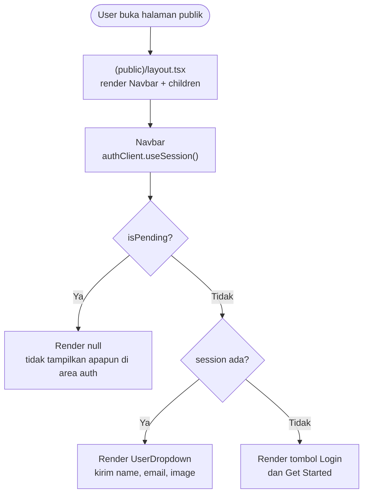
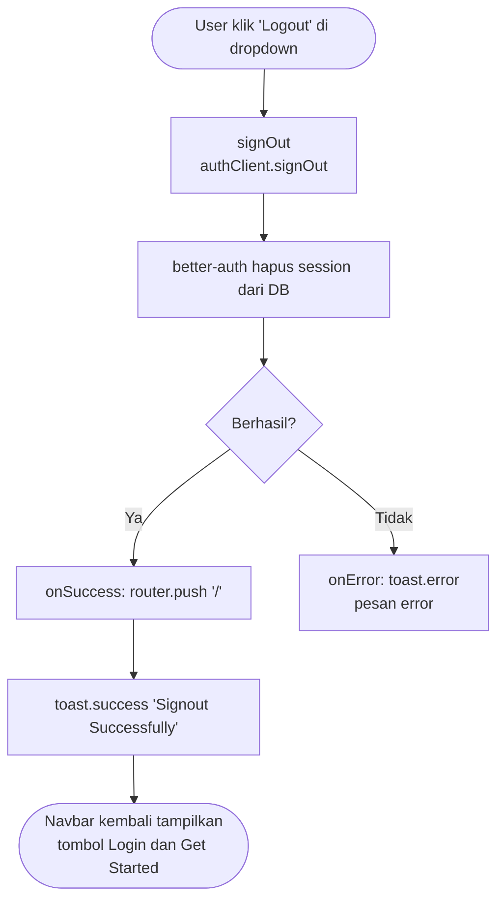
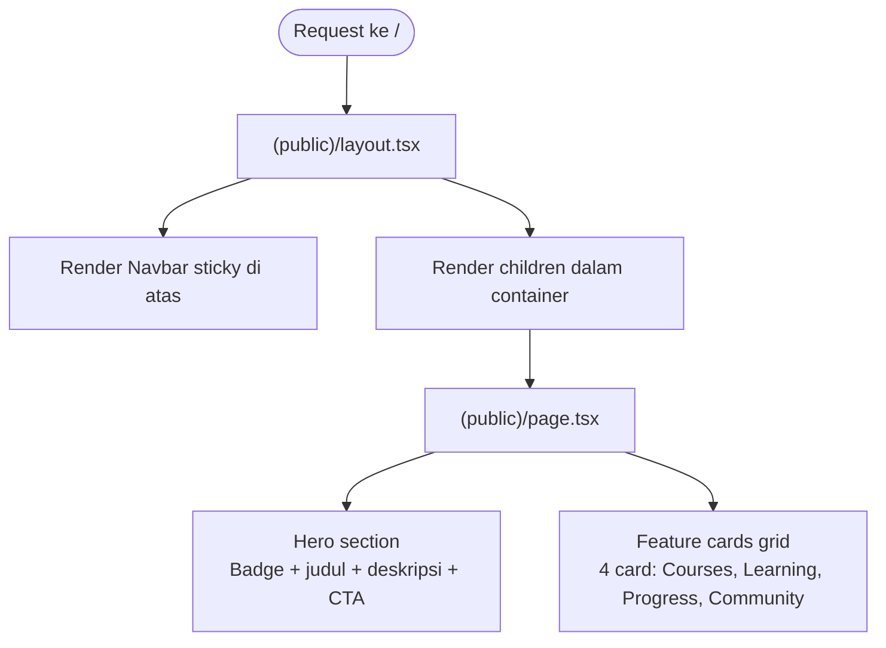

# Dokumentasi Landing Page dan Navbar

Dokumen ini menjelaskan implementasi halaman publik pertama — sebuah **landing page** dengan **navbar** yang session-aware, mencakup route group `(public)`, komponen `Navbar`, `UserDropdown`, dan halaman beranda dengan hero section dan feature cards.

---

## 1. Dependensi

Komponen ini memanfaatkan paket yang sudah tersedia di proyek:

| Package / Komponen | Sumber | Fungsi |
|---|---|---|
| `shadcn/ui` — Badge, Button, Card | shadcn (`radix-nova`) | Komponen UI dasar untuk landing page |
| `shadcn/ui` — Avatar, DropdownMenu | shadcn (`radix-nova`) | Komponen UI untuk UserDropdown |
| `lucide-react` | npm | Ikon (Home, BookOpen, LogOut, ChevronDown) |
| `next/image` | Next.js built-in | Render logo dengan optimasi otomatis |
| `next/link` | Next.js built-in | Navigasi client-side tanpa full reload |
| `authClient.useSession()` | `@/lib/auth-client` | Hook reaktif untuk membaca state session |
| `buttonVariants` | `@/components/ui/button` | Mengaplikasikan style button pada elemen `<Link>` |
| `ThemeToggle` | `@/components/ui/theme-toggle` | Tombol toggle dark/light mode |

> **Catatan:** `UserDropdown` terinspirasi dari komponen dropdown user di [Origin UI](https://originui.com/) — library komponen berbasis shadcn/ui.

---

## 2. Struktur File

File yang **ditambahkan** dalam implementasi ini (`app/page.tsx` dihapus):

```
└── app/
    ├── (public)/                        # Route group untuk halaman publik (BARU)
    │   ├── layout.tsx                   # Layout bersama: Navbar + container
    │   ├── page.tsx                     # Landing page: hero + feature cards
    │   └── _components/
    │       ├── Navbar.tsx               # Sticky navbar dengan auth buttons
    │       └── UserDropdown.tsx         # Dropdown avatar untuk user yang login
    │
    └── page.tsx                         # DIHAPUS — digantikan oleh (public)/page.tsx
```

---

## 3. Alur Kode

### 3.1 Alur Render Navbar Berdasarkan State Session



### 3.2 Alur Sign Out dari UserDropdown



### 3.3 Struktur Halaman Publik



---

## 4. Penjelasan dan Kode

### 4.1 `app/(public)/layout.tsx` — Layout Bersama Route Publik

Route group `(public)` membungkus semua halaman publik dengan layout yang sama. Tanda kurung pada nama folder berarti folder ini tidak ikut membentuk URL — `(public)/page.tsx` tetap di-serve di `/`.

```tsx
import { ReactNode } from "react";
import { Navbar } from "./_components/Navbar";

export default function layoutPublic({ children }: { children: ReactNode }) {
  return (
    <div>
      <Navbar />
      <main className="container mx-auto px-4 md:px-6 lg:px-8">{children}</main>
    </div>
  );
}
```

`container mx-auto` memastikan konten halaman tidak melebihi lebar maksimal dan selalu terpusat.

---

### 4.2 `app/(public)/_components/Navbar.tsx` — Sticky Navigation Bar

Client Component karena menggunakan `authClient.useSession()`. Navbar di-render sticky di bagian atas dengan efek backdrop blur.

```tsx
"use client";

import { authClient } from "@/lib/auth-client";
import { buttonVariants } from "@/components/ui/button";
import { UserDropdown } from "./UserDropdown";
import Link from "next/link";
import Image from "next/image";
import logo from "@/public/Logo.png";
import { ThemeToggle } from "@/components/ui/theme-toggle";

const navigationItems = [
  { name: "Home", href: "/" },
  { name: "Courses", href: "/courses" },
  { name: "Dashboard", href: "/dashborad" },
];

export function Navbar() {
  const { data: session, isPending } = authClient.useSession();

  return (
    <header className="sticky top-0 z-50 w-full border-b bg-background/95 backdrop-blur-[backdrop-filter]:bg-background/60">
      <div className="container flex min-h-16 items-center mx-auto px-4 md:px-6 lg:px-8">
        <Link href="/" className="flex items-center space-x-2 mr-4">
          <Image src={logo} alt="logo" className="size-9" />
          <span className="font-bold">LearnLMS</span>
        </Link>

        <nav className="hidden md:flex md:flex-1 md:items-center md:justify-between">
          <div className="flex items-center space-x-2">
            {navigationItems.map((item) => (
              <Link key={item.name} href={item.href}
                className="text-sm font-medium transition-colors hover:text-primary">
                {item.name}
              </Link>
            ))}
          </div>

          <div className="flex items-center space-x-2">
            <ThemeToggle />
            {isPending ? null : session ? (
              <UserDropdown
                email={session.user.email}
                image={session.user.image || ""}
                name={session.user.name}
              />
            ) : (
              <>
                <Link href="/login" className={buttonVariants({ variant: "secondary" })}>
                  Login
                </Link>
                <Link href="/login" className={buttonVariants()}>
                  Get Started
                </Link>
              </>
            )}
          </div>
        </nav>
      </div>
    </header>
  );
}
```

`isPending ? null` mencegah flash konten — saat session sedang di-load, area auth tidak di-render sama sekali, baru muncul setelah status diketahui.

`buttonVariants` digunakan pada `<Link>` (bukan `<Button>`) agar navigasi berjalan sebagai anchor tag native sekaligus mendapat styling button dari shadcn/ui.

---

### 4.3 `app/(public)/_components/UserDropdown.tsx` — Dropdown Menu User

Komponen ini hanya ditampilkan ketika session aktif. Menerima `name`, `email`, `image` sebagai props dari `Navbar`.

```tsx
import { Avatar, AvatarFallback, AvatarImage } from "@/components/ui/avatar";
import {
  DropdownMenu,
  DropdownMenuContent,
  DropdownMenuGroup,
  DropdownMenuItem,
  DropdownMenuLabel,
  DropdownMenuSeparator,
  DropdownMenuTrigger,
} from "@/components/ui/dropdown-menu";
import { BookOpen, ChevronDownIcon, Home, LogOutIcon } from "lucide-react";
import { authClient } from "@/lib/auth-client";
import { useRouter } from "next/navigation";
import { toast } from "sonner";
import Link from "next/link";

interface iAppProps {
  name: string;
  email: string;
  image: string;
}

export function UserDropdown({ email, name, image }: iAppProps) {
  const router = useRouter();

  async function signOut() {
    await authClient.signOut({
      fetchOptions: {
        onSuccess: () => {
          router.push("/");
          toast.success("Signout Successfuly");
        },
        onError: (error) => {
          toast.error(error.error.message);
        },
      },
    });
  }

  return (
    <DropdownMenu>
      <DropdownMenuTrigger asChild>
        <Button variant="ghost" className="h-auto p-0 hover:bg-transparent">
          <Avatar>
            <AvatarImage src={image} alt="Profile image" />
            <AvatarFallback>{name[0].toUpperCase()}</AvatarFallback>
          </Avatar>
          <ChevronDownIcon size={16} className="opacity-60" aria-hidden="true" />
        </Button>
      </DropdownMenuTrigger>
      <DropdownMenuContent align="end" className="max-w-64">
        <DropdownMenuLabel className="flex min-w-0 flex-col">
          <span className="text-foreground truncate text-sm font-medium">{name}</span>
          <span className="text-muted-foreground truncate text-xs font-normal">{email}</span>
        </DropdownMenuLabel>
        <DropdownMenuSeparator />
        <DropdownMenuGroup>
          <DropdownMenuItem asChild>
            <Link href="/"><Home size={16} className="opacity-60" aria-hidden="true" /><span>Home</span></Link>
          </DropdownMenuItem>
          <DropdownMenuItem asChild>
            <Link href="/courses"><BookOpen size={16} className="opacity-60" aria-hidden="true" /><span>Courses</span></Link>
          </DropdownMenuItem>
          <DropdownMenuItem asChild>
            <Link href="/dashboard"><BookOpen size={16} className="opacity-60" aria-hidden="true" /><span>Dashboard</span></Link>
          </DropdownMenuItem>
        </DropdownMenuGroup>
        <DropdownMenuItem onClick={signOut}>
          <LogOutIcon size={16} className="opacity-60" aria-hidden="true" />
          <span>Logout</span>
        </DropdownMenuItem>
      </DropdownMenuContent>
    </DropdownMenu>
  );
}
```

`AvatarFallback` menampilkan huruf pertama nama user (`name[0].toUpperCase()`) ketika gambar profil tidak tersedia atau gagal dimuat.

`DropdownMenuItem asChild` dengan `<Link>` memungkinkan item dropdown berfungsi sebagai navigasi client-side — Radix meneruskan props ke elemen child alih-alih membungkusnya.

---

### 4.4 `app/(public)/page.tsx` — Landing Page

Halaman utama dengan dua section: hero dan feature cards. Menggantikan `app/page.tsx` lama yang hanya berisi placeholder.

```tsx
"use client";

import { Badge } from "@/components/ui/badge";
import { buttonVariants } from "@/components/ui/button";
import { Card, CardContent, CardHeader, CardTitle } from "@/components/ui/card";
import { authClient } from "@/lib/auth-client";
import Link from "next/link";

interface featureProps {
  title: string;
  description: string;
  icon: string;
}

const features: featureProps[] = [
  {
    title: "Comprehensive Courses",
    description: "Access a wide range of carefully curated courses designed by industry experts",
    icon: "📚️",
  },
  {
    title: "Interactive Learning",
    description: "Engage with interactive content, quizzes, and assignments to enhance your learning experience",
    icon: "🎮️",
  },
  {
    title: "Progress Tracking",
    description: "Monitor your progress and achievements with detailed analytics and personalized dashboards",
    icon: "📊",
  },
  {
    title: "Community Support",
    description: "Join a vibrant community of learners and instructors to collaborate and share knowledge",
    icon: "👥",
  },
];

export default function Home() {
  const { data: session } = authClient.useSession();

  return (
    <>
      {/* Hero Section */}
      <section className="relative py-20">
        <div className="flex flex-col text-center items-center space-y-8">
          <Badge variant="outline">The Future of Online Edu</Badge>
          <h1 className="text-4xl md:text-6xl font-bold tracking-tight">
            Elevate Your Learning Experience
          </h1>
          <p className="max-w-175 text-muted-foreground md:text-xl">
            Discover a new way to learn with our modern, interactive
            learning management system. Access high-quality courses anytime, anywhere
          </p>
          <div className="flex flex-col sm:flex-row gap-4 mt-8">
            <Link className={buttonVariants({ size: "lg" })} href="/courses">
              Explore Courses
            </Link>
            <Link className={buttonVariants({ size: "lg", variant: "outline" })} href="/login">
              Sign In
            </Link>
          </div>
        </div>
      </section>

      {/* Feature Cards */}
      <section className="grid grid-cols-1 md:grid-cols-2 lg:grid-cols-4 gap-6">
        {features.map((feature, index) => (
          <Card key={index} className="hover:shadow-lg transition-shadow">
            <CardHeader>
              <div className="text-4xl mb-4">{feature.icon}</div>
              <CardTitle>{feature.title}</CardTitle>
            </CardHeader>
            <CardContent>
              <p className="text-muted-foreground">{feature.description}</p>
            </CardContent>
          </Card>
        ))}
      </section>
    </>
  );
}
```

Data `features` didefinisikan di luar komponen agar tidak dibuat ulang setiap render. Grid responsif berubah dari 1 kolom (mobile) → 2 kolom (tablet) → 4 kolom (desktop) via Tailwind breakpoint classes.

---

## Ringkasan Pola Penting

| Kebutuhan | Solusi | File |
|---|---|---|
| Tampilkan navbar di semua halaman publik | Route group `(public)` + `layout.tsx` | `app/(public)/layout.tsx` |
| Render link sebagai button | `buttonVariants` pada `<Link>` | `Navbar.tsx`, `page.tsx` |
| Cegah flash saat session loading | `isPending ? null : session ? ...` | `Navbar.tsx` |
| Fallback avatar tanpa gambar | `AvatarFallback` dengan `name[0].toUpperCase()` | `UserDropdown.tsx` |
| Dropdown item sebagai navigasi | `DropdownMenuItem asChild` + `<Link>` | `UserDropdown.tsx` |
